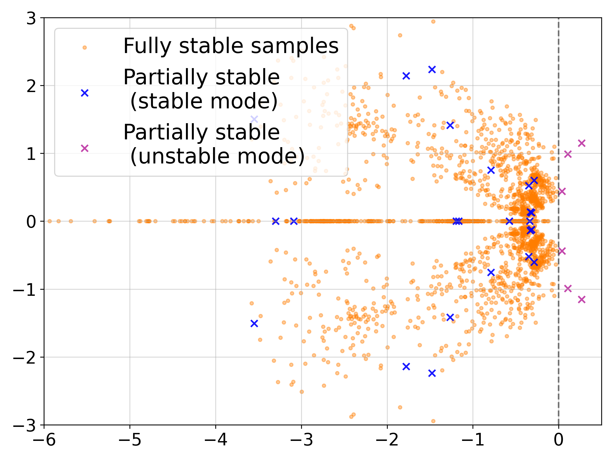

# Learning Riccati Solution Operators with DeepONet

This repository accompanies the paper [*Learning the Riccati solution operator for time-varying LQR via Deep Operator Networks*](https://arxiv.org/abs/2604.18507).
It provides reproducible Jupyter notebooks for learning the solution maps of algebraic and differential Riccati equations 
with Deep Operator Networks (DeepONets). The learned models replace repeated numerical Riccati solves with fast evaluations 
of an operator surrogate for families of linear-quadratic regulator (LQR) problems.



## Motivation

The Linear Quadratic Regulator is a standard method for designing feedback controllers that balance state regulation 
against control effort. For a finite-horizon, time-varying system, the optimal feedback gain is obtained from a 
matrix-valued differential Riccati equation; for time-independent systems, the corresponding problem is an algebraic Riccati equation.

Classical solvers compute a Riccati solution separately for every new combination of system and cost matrices. 
This becomes costly when parameters vary repeatedly, as in parametric control, uncertainty quantification, model predictive 
control, and real-time applications. The aim here is to shift this cost to an offline learning stage and make online 
evaluations for unseen system instances fast.

## Approach implemented

The Riccati equation is treated as a solution operator: it maps the system dynamics and LQR cost matrices to the matrix 
trajectory that defines the optimal feedback law. A DeepONet learns this mapping from datasets of parameter–solution 
pairs generated with classical Riccati solvers.

DeepONet separates the task into two parts: a branch network encodes the system and cost parameters, while a trunk 
network encodes time. Their outputs are combined to predict the entries of the Riccati matrix. This enables one trained 
network to generalize across a family of LQR instances rather than solving or retraining from scratch for each one.

The paper also establishes how the approximation error in the learned Riccati operator affects the feedback gain, 
closed-loop trajectories, control cost, and stability. In particular, sufficiently accurate approximations preserve 
exponential closed-loop stability. To address growth in problem size, the 4D progressive DeepONet experiment transfers 
knowledge from a trained lower-dimensional model and fine-tunes only a reduced set of parameters.

The numerical experiments cover 3D, 4D, and 10D algebraic Riccati equations, as well as 3D and 10D time-varying 
differential Riccati equations. They assess solution accuracy, closed-loop stabilization, generalization, and 
inference time against conventional Riccati solvers.

## Repository contents

| Notebook or file | Purpose |
| --- | --- |
| `ARE_3D.ipynb` | Learns the 3D algebraic Riccati solution map and evaluates closed-loop stability and runtime. |
| `ARE_3D_10_tests.ipynb` | Repeats the 3D algebraic experiment over multiple test instances. |
| `ARE_4D_Standard.ipynb` | Trains a standard DeepONet for the 4D algebraic Riccati equation. |
| `ARE_4D_Progressive.ipynb` | Implements progressive operator learning for the 4D algebraic problem. |
| `ARE_10D.ipynb` | Learns and evaluates the 10D algebraic Riccati solution map. |
| `DRE_3D.ipynb` | Learns the 3D time-varying differential Riccati trajectory operator. |
| `DRE_10D.ipynb` | Learns the 10D time-varying differential Riccati trajectory operator. |

## Requirements

Use Python 3.10 or newer with Jupyter and the following packages:

```bash
pip install jupyter numpy scipy matplotlib torch
```

The notebooks automatically use a CUDA GPU when PyTorch detects one; CPU execution is supported but can take 
substantially longer for the larger experiments.

## Running the simulations

From this directory, launch Jupyter:

```bash
jupyter notebook
```

Each notebook is self-contained: it generates its dataset, trains its DeepONet, and produces the corresponding 
evaluation figures and timing comparisons. Run a notebook from top to bottom to reproduce its experiment.

For a natural progression through the experiments, begin with `ARE_3D.ipynb`, compare the standard and progressive 
4D approaches using `ARE_4D_Standard.ipynb` and `ARE_4D_Progressive.ipynb`, then run the 10D algebraic and time-varying cases. 
The 10D notebooks generate larger datasets and therefore require more memory and training time.

## Reference

J. Chen, U. Biccari, and J. Wang, *Learning the Riccati solution operator for time-varying LQR via Deep Operator Networks*, 2026. 
The manuscript is available on [arXiv:2604.18507](https://arxiv.org/abs/2604.18507).  

## Funding

This project has received funding from the European Research Council (ERC) under the European Union's Horizon 2030 
research and innovation programme (grant agreement No. 101096251, CoDeFeL). 
